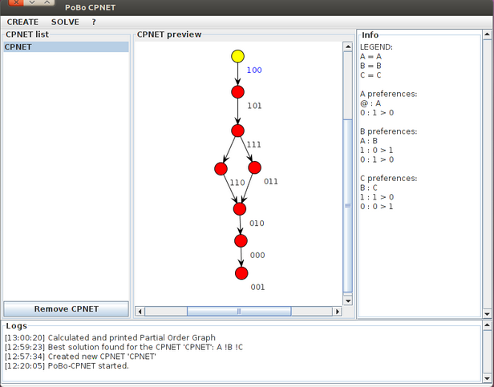

Description
--
PoBo-CP-Net is a Java suite for **acyclic cp-nets**. You can use it as standard application or as a library in your project.

What you can do
--
Given an acyclic cp-net you can:

- get the **optimal solution**

- **compare** two solution

- extract the **partial order** of solutions

Application usage
--
-To run PoBo-CP-Net as an application, from te /bin directory

<pre><code>java -jar PoBoCPNET.jar</code></pre>

-To use it as a library, first add the PoBoCPNET.jar in your path. Here it is a usage example:

<pre><code>//...
//You can load/save cp-net in XML format
//CPNET cpnet = XMLInterface.readCPNET("test.xml");

//Via code creation
CPNET cpnet = new CPNET(3);
cpnet.addVertex("A");
cpnet.addVertex("B");
cpnet.addVertex("C");
cpnet.addEdge("A", "B");
cpnet.addEdge("B", "C");

cpnet.generate();

cpnet.setPreference("A", "0", 1);
cpnet.setPreference("B", "1", 1);
cpnet.setPreference("B", "0", 0);
cpnet.setPreference("C", "1", 1);
cpnet.setPreference("C", "0", 0); 

System.out.println("Best Solution: " + cpnet.getOptimalSolution().getSolutionAsString());

System.out.println("Partial Order:" + cpnet.getPartialOrder());
//...
</code></pre>
